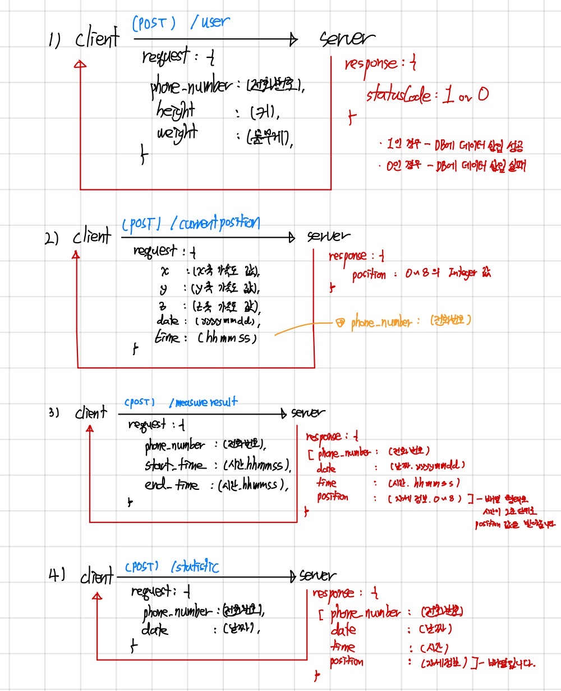

# Main Server

## Routers
### user
* (POST) http://weltried.ga/user
    - You will get statuscode which represents whether data is inserted to database.
``` javascript
{ "statusCode" 0 or 1 }
```

### currentposition
* (POST) http://weltried.ga/currentposition
    - You will get object which contained INTEGER_VALUE between 0 to 8.
    - INTEGER_VALUE shows user's sitting posture.
``` javascript
{ "position" : INTEGER_VALUE }
```

### measureresult
* (POST) http://weltried.ga/measureresult
    - You will get like below array.
``` javascript
[{
    "phone_number"  : "01012345678",
    "date"          : "20220512",
    "time"          : "175637",
    "position"      : INTEGER_VALUE
},
{
    "phone_number"  : "01012345678",
    "date"          : "20220512",
    "time"          : "175639",
    "position"      : INTEGER_VALUE
},
{
    "phone_number"  : "01012345678",
    "date"          : "20220512",
    "time"          : "175641",
    "position"      : INTEGER_VALUE
}]
```

### statistic
* (POST) http://weltried.ga/statistic
    - You will get the day of posture data which you requested in `date`
    - The data form is same as above (/measureresult).

## Story


