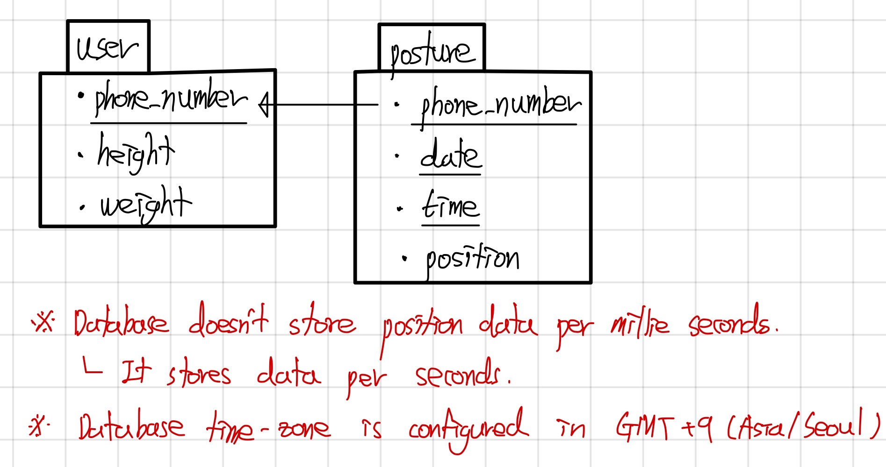

# server
Servers is running on Azure instance.
* weltried.ga

* A test server which just return constant value to client is running independently.

* A Main Server will only communicate with a client, which means server system is Reverse Proxy.
    - Only the Main Server communicates with others which are AI-Model Server and Database.

## About Test Server
The test server is developed by Node.js express. It is running on port 8080.
* You can test server using `curl` command.

* (POST) http://weltried.ga:8080/user
``` bash
curl -X POST http://weltried.ga:8080/user
```

* (POST) http://weltried.ga:8080/currentposition
``` bash
curl -X POST http://weltried.ga:8080/currentposition
```

~~* (POST) http://weltried.ga:8080/measureresult~~
``` bash
curl -X POST http://weltried.ga:8080/measureresult
```

* (POST) http://weltried.ga:8080/statistic
``` bash
curl -X POST http://weltried.ga:8080/statistic
```

## About Main Server
The main server is developed by Node.js express. It is running on port 80.
* (POST) http://weltried.ga/user ([DETAILS](./Main/#user))

* (POST) http://weltried.ga/currentposition ([DETAILS](./Main/#currentposition))

~~* (POST) http://weltried.ga/measureresult ([DETAILS](./Main/#measureresult))~~

* (POST) http://weltried.ga/statistic ([DETAILS](./Main/#statistic))

## About AI-Model Server
The AI-Model Server is developed by Python flask.
<p>you don't have to know routers of this server,
but if you wish ... <a href="./AI-Model">DETAILS</a></p>

## About Database
The database uses MySQL.<br/>
The database schema is shown below.

